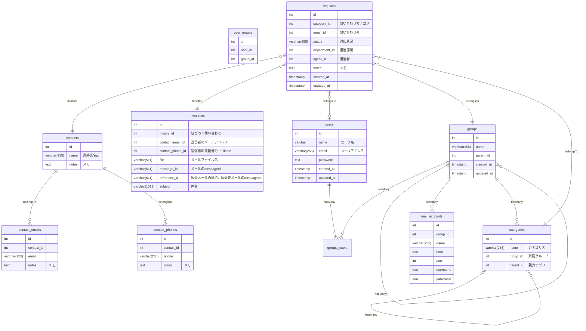
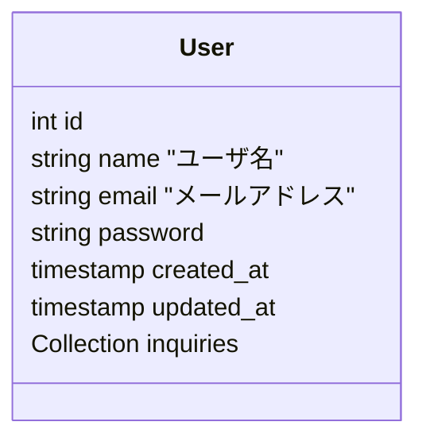
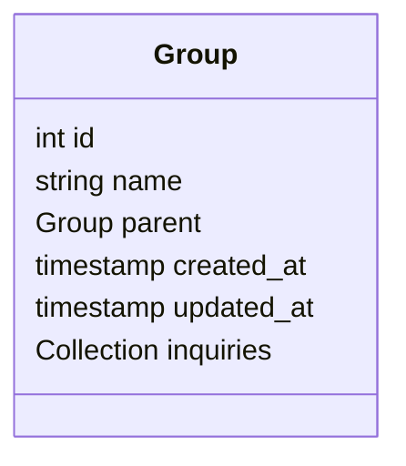
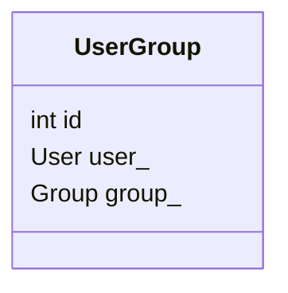
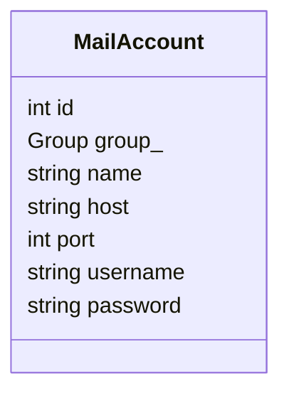
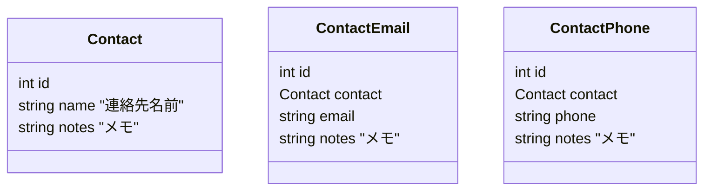
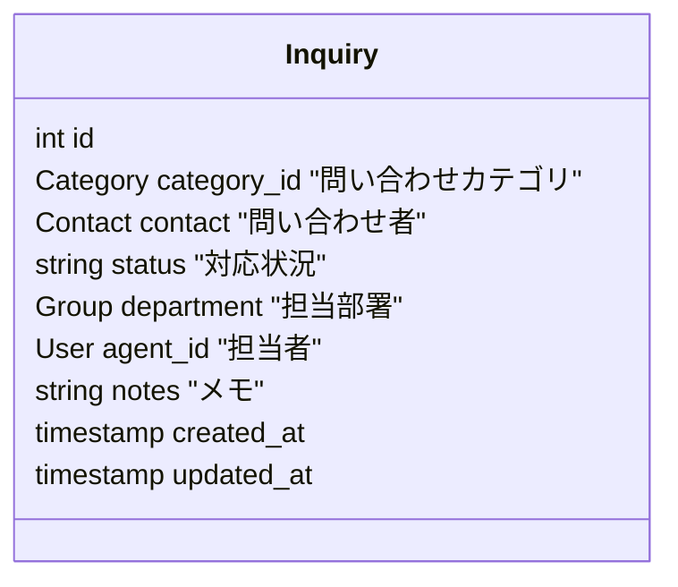
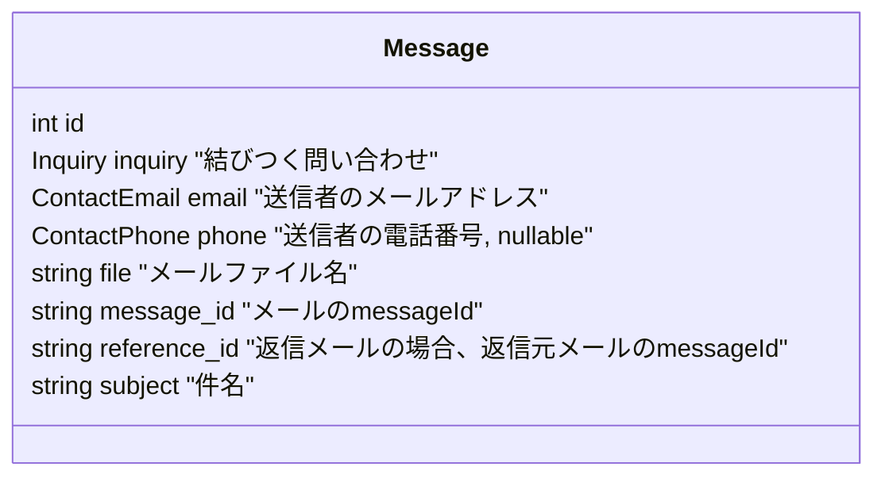
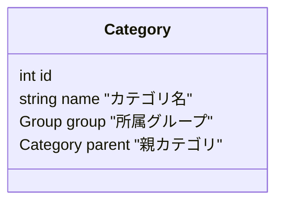

# Cumas - A simple customer support management system
[](https://travis-ci.org/lb-cumas/cumas)[](https://coveralls.io/github/lb-cumas/cumas?branch=master)

cumas is a simple customer support management system. It is designed to be simple and easy to use. It is written in php symphony framework.

# instration

# features
1. gather customer inquiries from multiple mail accounts
1. assign inquiries to agents and track their progress
1. agents can interract with customers via embedded mail feature
1. manage customer information

# design
## database table(overview)


## entities








# Domain
## Category

```mermaid
classDiagram
	
```
## Contact
```mermaid
classDiagram
```

## Group
```mermaid
classDiagram
```

## Inquiry
```mermaid
classDiagram
```

## MailAccount
```mermaid
classDiagram
```

## Message
```mermaid
classDiagram
```

## User
```mermaid
classDiagram
```
